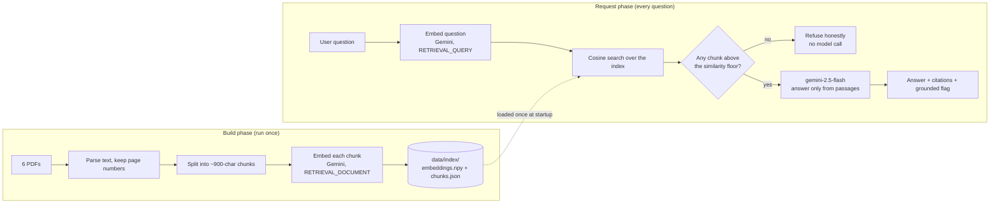

# AgamiSoft AI Document Assistant

An internal question-answering assistant for AgamiSoft Ltd. Employees ask
everyday questions in plain English ("How many days of annual leave do I get?",
"What discount can I approve on my own?") and get a short, accurate answer that
is drawn only from the company's own documents. Every answer shows exactly which
document and page it came from, and when the documents genuinely do not cover a
question, the assistant says so rather than making something up.

This is a retrieval-augmented generation (RAG) system built over a fixed set of
six PDFs (Employee Handbook, HR Policy, Leave Policy, Sales Handbook, Company
Profile, and an FAQ), roughly eleven pages in total.

---

## 1. What problem this solves

The company's policies are spread across several PDFs. Finding a single fact,
such as the notice period for resignation or the approval limit for a discount,
means opening the right file and scanning through it. This assistant removes that
friction. You ask a question once, and it reads the relevant passages for you and
answers in a sentence or two, with a citation you can check.

The single most important design goal is trust. An assistant that occasionally
invents a policy is worse than no assistant at all, because people would act on
wrong information. So the system is built to only ever answer from the source
documents, and to openly refuse when it cannot.

---

## 2. How it works, end to end

There are two distinct phases: a one-time **build phase** that prepares the
documents, and the **request phase** that runs every time someone asks a
question.

### The build phase (done once, ahead of time)

Think of this as turning the PDFs into something searchable by meaning rather
than by keyword.

1. **Read the PDFs.** Each PDF is opened and its text is pulled out page by page,
   keeping track of which page each piece of text came from. That page number is
   what later lets an answer say "HR Policy.pdf, page 2".

2. **Split into chunks.** A whole page is often too large and mixes several
   topics, which makes retrieval blunt. So each page is split into smaller,
   self-contained passages of up to about 900 characters, broken on paragraph
   boundaries so a section stays intact. Consecutive chunks share a small overlap
   so a sentence that straddles a boundary is not lost. For this corpus that
   yields 21 chunks across the 6 documents. Every chunk carries its source
   document and page number.

3. **Turn each chunk into a vector (an embedding).** Each chunk of text is sent
   to Google's embedding model, which returns a list of 3072 numbers that
   captures the meaning of that text. Passages about leave end up numerically
   close to each other, and far from passages about, say, sales discounts. This
   is what lets the system match a question to text by meaning, even when the
   wording is different.

4. **Save the index.** All the vectors are stored together in one file
   (`data/index/embeddings.npy`) and the matching chunk text and metadata in
   another (`data/index/chunks.json`). Together these two files are the
   "knowledge base". This step is the only time the documents are embedded; the
   running service never repeats it.

### The request phase (every question)

1. **Embed the question.** The user's question is sent to the same embedding
   model and becomes a vector, so it can be compared against the stored chunks.
   (A small but important detail: chunks are embedded as "documents" and
   questions as "queries". The model is told which is which, and this asymmetry
   noticeably improves how well questions match the right passages.)

2. **Retrieve the closest chunks.** The question vector is compared against all
   21 chunk vectors using cosine similarity, which measures how aligned two
   vectors are on a scale from roughly 0 (unrelated) to 1 (identical meaning).
   The top few most similar chunks are selected.

3. **Decide whether the corpus can actually answer.** This is the first line of
   defence against made-up answers. If none of the retrieved chunks clears a
   minimum similarity score, the system concludes the documents do not cover the
   question and immediately returns "I don't have enough information in the
   provided documents to answer that." It does this **without ever calling the
   language model**, which makes off-topic questions both instant and impossible
   to hallucinate.

4. **Generate a grounded answer.** If some chunks are relevant, they are handed
   to Google's `gemini-2.5-flash` model along with the question and a strict
   instruction: answer only from these passages, keep it concise, invent nothing,
   and if the passages do not actually contain the answer, say so. This is the
   second line of defence: even when retrieval returns something, the model is
   still allowed and expected to refuse if the text does not truly answer the
   question.

5. **Return the answer with citations.** The response includes the answer text,
   the list of source passages that supported it (document, page, a short
   snippet, and the similarity score), and a `grounded` flag that is `true` for a
   real answer and `false` for a refusal.

### The two-layer no-hallucination guarantee

It is worth restating because it is the heart of the system. Answers are kept
honest in two independent ways:

- A **retrieval gate**: nothing relevant found means an immediate, model-free
  refusal.
- A **generation instruction**: when the model does run, it is constrained to the
  provided passages and told to refuse rather than guess.

Either layer alone would catch most cases. Together they make a fabricated
policy very unlikely.

---

## 3. Architecture at a glance



Because the index is prepared ahead of time and shipped inside the deployed
image, the live service only talks to Gemini for two quick things per request:
embedding the question and writing the answer. It never parses PDFs or rebuilds
the index while serving traffic, which keeps responses fast and start-up
instant.

---

## 4. The code, module by module

The application lives in `app/` and is organised so each file has one job. The
layers are kept separate on purpose: input and output (the API), the reasoning
(retrieval and orchestration), and the outside world (Gemini, the file-based
index) never blur into one another.

| Module | What it does |
|---|---|
| `config.py` | Reads all settings from the environment once and exposes them as a single, read-only `settings` object. Nothing else in the code reads environment variables directly. |
| `schemas.py` | Defines the request and response shapes with Pydantic. This is the API contract: a `QueryRequest` in, a `QueryResponse` (answer, citations, grounded flag) out. |
| `ingest.py` | Turns PDFs into clean, page-tagged chunks. Handles whitespace tidy-up, paragraph-aware splitting, and the rare oversized paragraph. |
| `gemini.py` | The only place that talks to Google Gemini. Exposes two functions, `embed_texts`/`embed_query` for vectors and `generate_answer` for the grounded reply, and raises a single custom `GeminiError` on any failure. Keeping the provider behind one small module means it could be swapped without touching the rest of the app. |
| `vectorstore.py` | The searchable index. Builds and loads the vectors, and runs the cosine similarity search that finds the closest chunks to a question. |
| `rag.py` | The conductor. It embeds the question, retrieves chunks, applies the similarity gate, calls the model when appropriate, and assembles the final answer with citations. |
| `main.py` | The FastAPI web layer. Loads the index at start-up, serves the `/query` and `/health` endpoints and the web page, and translates internal errors into clear HTTP responses. |
| `scripts/build_index.py` | The build-phase entry point. Run it to (re)create the index from the PDFs. |
| `static/index.html` | A single-page interface for asking questions and seeing answers with their citations. |

---

## 5. Design decisions worth knowing

These are the choices most likely to come up in review, with the reasoning
behind them.

- **A NumPy array instead of a vector database.** With only 21 chunks, comparing
  a question against every chunk is effectively instantaneous and gives exact
  results. A dedicated vector database such as FAISS or pgvector would add a heavy
  dependency and operational weight to solve a scaling problem this corpus does
  not have. The search code is small and isolated, so moving to FAISS later would
  be a contained change. This is a deliberate "right-sized" choice, not a
  shortcut.

- **Gemini for both embeddings and generation.** Using one provider for both
  halves of RAG keeps the system simple and the setup to a single API key. Gemini
  also offers strong retrieval embeddings and a capable, fast generation model on
  a generous free tier.

- **`gemini-2.5-flash` with reasoning turned off, not a newer "thinking" model.**
  Newer models spend time on internal reasoning before answering, which on the
  free tier can take 30 seconds or more per question. For looking up a fact in a
  short passage that reasoning adds latency without improving the answer.
  Disabling it gives correct, grounded answers in about one second, which is the
  right trade for an interactive assistant.

- **Asymmetric embeddings.** Chunks and questions are embedded with different
  task hints (`RETRIEVAL_DOCUMENT` and `RETRIEVAL_QUERY`). This is the model's
  intended usage for search and measurably improves which passages get matched.

- **A tunable similarity floor.** The line between "answerable" and "not in the
  documents" is a single configurable number (`RETRIEVAL_MIN_SIMILARITY`). Raising
  it makes the assistant more cautious (more refusals, fewer wrong answers);
  lowering it makes it more willing to attempt an answer. It is set to a value
  tuned for this corpus.

---

## 6. Setup and running it locally

You need Python 3.12 or newer and a Google Gemini API key, which you can create
for free at [Google AI Studio](https://aistudio.google.com/apikey).

```bash
# 1. Install dependencies
pip install -r requirements.txt

# 2. Provide your API key
cp .env.example .env
#    then open .env and set GEMINI_API_KEY to your key

# 3. Build the index from the PDFs (needed once, and again only if the docs change)
python -m scripts.build_index

# 4. Start the app
uvicorn app.main:app --reload
#    then open http://127.0.0.1:8000 in a browser
```

The first three steps prepare the knowledge base; the fourth serves it. If you
change, add, or remove a PDF in `sample_docs/`, re-run step 3 to refresh the
index.

### Running the tests

```bash
pytest
```

There are 18 unit tests covering chunking, the vector search (including edge
cases like an empty index or a zero-length question vector), and all three
answer paths (a grounded answer, a refusal because nothing was relevant, and a
refusal because the model judged the passages insufficient). Every Gemini call is
mocked, so the tests need no API key, no network, and give the same result every
time.

---

## 7. Using the API

The assistant is an API first, with the web page sitting on top of it.
Interactive, auto-generated API docs are available at `/docs` once the app is
running.

### Ask a question: `POST /query`

Request body:

```json
{ "question": "How many days of annual leave do I get?" }
```

Successful response:

```json
{
  "answer": "Confirmed full-time employees receive 20 days of annual (earned) leave per year.",
  "citations": [
    {
      "document": "Leave Policy.pdf",
      "page": 1,
      "snippet": "Annual (Earned) Leave 20 Accrues monthly; up to 10 days may carry over ...",
      "score": 0.71
    }
  ],
  "grounded": true
}
```

When the documents do not cover the question, the shape is the same but `answer`
explains that the information is unavailable, `citations` is empty, and
`grounded` is `false`.

### Check status: `GET /health`

```json
{ "status": "ok", "documents": 6, "chunks": 21 }
```

This confirms the index loaded correctly and reports how many documents and
chunks are in it. If the index failed to load, `status` is `degraded`.

### How errors are handled

The API fails clearly rather than silently:

- An empty or over-long question is rejected with `422` and a message saying why.
- If the index could not be loaded, `/query` returns `503` explaining the
  knowledge base is unavailable.
- If Gemini itself fails (network, quota, or an outage), the error is logged and
  the caller gets a `502` with a plain-language message, never a stack trace or
  internal detail.

---

## 8. Configuration

Everything tunable is an environment variable with a sensible default, so the app
runs with just an API key set. The defaults are shown.

| Variable | Default | Purpose |
|---|---|---|
| `GEMINI_API_KEY` | (required) | Your Gemini key, used for both embeddings and generation. |
| `GEMINI_GENERATION_MODEL` | `gemini-2.5-flash` | The model that writes the answer. |
| `GEMINI_EMBEDDING_MODEL` | `gemini-embedding-001` | The model that turns text into vectors. |
| `RETRIEVAL_TOP_K` | `5` | How many chunks to retrieve per question. |
| `RETRIEVAL_MIN_SIMILARITY` | `0.55` | The cut-off below which a question is treated as unanswerable. |
| `MAX_QUESTION_LENGTH` | `1000` | Longest question accepted, as a basic safeguard. |

---

## 9. Deployment (Google Cloud Run)

The index is committed to the repository and copied into the container image at
build time, so deploying is just a container build and deploy. The Gemini key is
supplied at run time as an environment variable (ideally via Secret Manager) and
is never baked into the image or committed.

```bash
gcloud run deploy agamisoft-assistant \
  --source . \
  --region asia-south1 \
  --allow-unauthenticated \
  --set-env-vars GEMINI_API_KEY=your-key
```

Cloud Run tells the container which port to listen on through a `PORT`
environment variable, which the container's start command already respects. The
same container runs locally with `docker build -t assistant . && docker run -p
8080:8080 -e GEMINI_API_KEY=your-key assistant`.

---

## 10. Assumptions

- The document set is fixed and small, so it is prepared ahead of time rather
  than uploaded at run time.
- Every source PDF contains real, selectable text (this was verified: all eleven
  pages yield text and a page number, so citations are always available).
- One Gemini key serves both embeddings and generation.
- No login is required, so no test credentials are needed.

## 11. Limitations and honest edges

- Answers reflect the committed PDFs. Changing a document requires re-running
  `python -m scripts.build_index` to refresh the index.
- Exact NumPy search is ideal for this corpus. A collection thousands of times
  larger would justify moving to a dedicated vector database; the search module
  is isolated to make that swap straightforward.
- The similarity floor is a single global threshold. It balances refusing too
  eagerly against answering too loosely, and it is tuned for this corpus rather
  than learned per question.
- Retrieval is single-shot. The system does not rewrite the question or chain
  multiple retrieval steps, which a broader corpus or multi-part questions might
  eventually benefit from.
