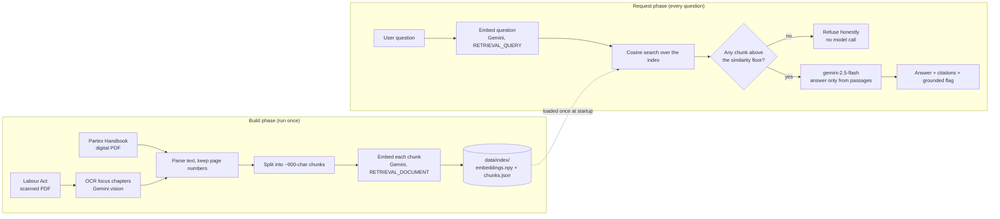

# Enterprise AI Assistant for Partex-Star-Group Employee Onboarding & HR Policies

[](https://udt934xmby.us-east-1.awsapprunner.com)

An internal question-answering assistant for Partex Star Group. Employees ask
everyday questions in plain English ("What are the working hours?", "How many
days of casual leave do I get?", "What is the probation period for a clerical
worker?") and get a short, accurate answer drawn only from the company handbook
and the Bangladesh Labour Act. Every answer shows exactly which document and
page it came from, and when the documents genuinely do not cover a question, the
assistant says so rather than making something up.

This is a retrieval-augmented generation (RAG) system built over two sources:

1. **Partex Star Group Employee Handbook** (6 pages): onboarding, HR policies,
   code of conduct, leave, facilities, and work culture.
2. **A Handbook on the Bangladesh Labour Act 2006**, focused on the two chapters
   that govern the employment relationship:
   - **Chapter 02 (pages 25 to 32): Conditions of Service and Employment**
   - **Chapter 09 (pages 56 to 60): Working Hours and Leave**

---

## 1. What problem this solves

New and existing employees have questions that are answered across a company
handbook and, underneath it, the national labour law. Finding a single fact,
such as the probation period, the notice required to resign, or the legal cap on
daily working hours, means knowing which document to open and scanning through
it. This assistant removes that friction. You ask a question once, and it reads
the relevant passages for you and answers in a sentence or two, with a citation
you can check.

The single most important design goal is trust. An assistant that occasionally
invents a policy is worse than no assistant at all, because people would act on
wrong information. So the system is built to only ever answer from the source
documents, and to openly refuse when it cannot.

---

## 2. A wrinkle worth knowing: the Labour Act is a scanned book

The Partex handbook is a normal digital PDF, so its text is read directly. The
Bangladesh Labour Act handbook, however, is a **181-page scanned document**:
every page is a photograph of a page, with no selectable text layer at all. A
normal PDF text extractor returns nothing for it.

Since only the two focus chapters are in scope, the repository commits just the
**13 pages actually used**, as a trimmed excerpt in `sample_docs/` (1.3 MB
instead of the 16 MB original). Those pages are put through **OCR (optical
character recognition) once, at build time**, using Gemini's vision model. The
recovered text is cached to `data/ocr/labour_act.json` and committed, so the
expensive vision step never runs again. Page numbers in the cache are the
handbook's **printed** page numbers, so a citation that says "page 25" matches
the physical book.

One page (printed page 29) is filled from a direct transcription of the scan
rather than the model: Gemini refuses to output it because its safety filter
flags the verbatim legal text as copyrighted (finish reason `RECITATION`). The
OCR helper surfaces that condition explicitly instead of silently returning
blank, and that single page was transcribed by hand from the same scan.

---

## 3. How it works, end to end

There are two distinct phases: a one-time **build phase** that prepares the
documents, and the **request phase** that runs every time someone asks a
question.

### The build phase (done once, ahead of time)

1. **Read the Partex handbook.** Its text is pulled out page by page, keeping
   track of which page each piece came from.

2. **OCR the Labour Act focus chapters.** The 13 scanned pages of Chapters 2 and
   9 are transcribed with Gemini vision into `data/ocr/labour_act.json`
   (`scripts/ocr_labour_act.py`).

3. **Split into chunks.** A whole page is often too large and mixes several
   topics, which makes retrieval blunt. So each page is split into smaller,
   self-contained passages of up to about 900 characters, broken on paragraph
   boundaries so a section stays intact. Consecutive chunks share a small overlap
   so a sentence that straddles a boundary is not lost. For this corpus that
   yields **84 chunks across the 2 documents** (21 from the Partex handbook, 63
   from the Labour Act chapters). Every chunk carries its source document and
   page number.

4. **Turn each chunk into a vector (an embedding).** Each chunk is sent to
   Google's embedding model, which returns a list of 3072 numbers capturing its
   meaning. Passages about leave end up numerically close to each other, and far
   from passages about, say, appointment letters. This is what lets the system
   match a question to text by meaning, even when the wording is different.

5. **Save the index.** The vectors are stored in `data/index/embeddings.npy` and
   the matching chunk text and metadata in `data/index/chunks.json`. Together
   these two files are the "knowledge base". The running service never repeats
   this step.

### The request phase (every question)

1. **Embed the question** with the same embedding model, so it can be compared
   against the stored chunks. (Chunks are embedded as "documents" and questions
   as "queries"; the model is told which is which, and this asymmetry noticeably
   improves matching.)

2. **Retrieve the closest chunks** by cosine similarity, a measure of how aligned
   two vectors are on a scale from roughly 0 (unrelated) to 1 (identical
   meaning). The top few most similar chunks are selected.

3. **Decide whether the corpus can actually answer.** This is the first line of
   defence against made-up answers. If none of the retrieved chunks clears a
   minimum similarity score, the system returns "I don't have enough information
   in the provided documents to answer that." It does this **without ever calling
   the language model**, which makes off-topic questions both instant and
   impossible to hallucinate.

4. **Generate a grounded answer.** If some chunks are relevant, they are handed
   to Google's `gemini-2.5-flash` along with the question and a strict
   instruction: answer only from these passages, keep it concise, invent nothing,
   and if the passages do not actually contain the answer, say so. This is the
   second line of defence.

5. **Return the answer with citations**: the answer text, the supporting passages
   (document, page, snippet, similarity score), and a `grounded` flag that is
   `true` for a real answer and `false` for a refusal.

### The two-layer no-hallucination guarantee

Answers are kept honest in two independent ways:

- A **retrieval gate**: nothing relevant found means an immediate, model-free
  refusal.
- A **generation instruction**: when the model does run, it is constrained to the
  provided passages and told to refuse rather than guess.

Together they make a fabricated policy very unlikely.

---

## 4. Architecture at a glance



Because the index is prepared ahead of time and shipped inside the deployed
image, the live service only talks to Gemini for two quick things per request:
embedding the question and writing the answer. It never parses PDFs, runs OCR, or
rebuilds the index while serving traffic.

---

## 5. The code, module by module

The application lives in `app/` and is organised so each file has one job. The
layers are kept separate on purpose: input and output (the API), the reasoning
(retrieval and orchestration), and the outside world (Gemini, the file-based
index) never blur into one another.

| Module | What it does |
|---|---|
| `config.py` | Reads all settings from the environment once and exposes them as a single, read-only `settings` object. Nothing else reads environment variables directly. |
| `schemas.py` | Defines the request and response shapes with Pydantic: a `QueryRequest` in, a `QueryResponse` (answer, citations, grounded flag) out. |
| `ingest.py` | Turns sources into clean, page-tagged chunks. Reads text PDFs and merges in OCR'd pages (`iter_ocr_pages`), with a shared chunker so ids stay contiguous. |
| `gemini.py` | The single place that talks to the LLM providers. Exposes `embed_texts`/`embed_query` for vectors, `generate_answer` for the grounded reply (Gemini, falling back to Groq on failure), and `ocr_image` for build-time OCR of scanned pages. |
| `vectorstore.py` | The searchable index. Builds and loads the vectors and runs the cosine similarity search. |
| `rag.py` | The conductor. Embeds the question, retrieves chunks, applies the similarity gate, calls the model when appropriate, and assembles the answer with citations. |
| `main.py` | The FastAPI web layer. Loads the index at start-up, serves `/query`, `/health`, and the web page, and translates internal errors into clear HTTP responses. |
| `scripts/build_index.py` | The build-phase entry point: parse and OCR the corpus, then embed and save the index. |
| `scripts/ocr_labour_act.py` | One-time OCR of the Labour Act focus chapters into `data/ocr/labour_act.json` (resumable; skips pages already cached). |
| `static/index.html` | A single-page interface for asking questions and seeing answers with their citations. |

---

## 6. Design decisions worth knowing

- **OCR the scanned handbook once, at build time.** The Labour Act PDF has no
  text layer, so its focus chapters are transcribed with Gemini vision during the
  build and cached. Nothing about OCR touches the running service. Scoping the
  OCR to the two required chapters (13 pages) keeps it cheap and fast; the rest of
  the 181-page book is out of scope, and the assistant honestly refuses labour-law
  questions outside those chapters rather than guessing.

- **A NumPy array instead of a vector database.** With 84 chunks, comparing a
  question against every chunk is effectively instantaneous and gives exact
  results. A dedicated vector database such as FAISS or pgvector would add a heavy
  dependency to solve a scaling problem this corpus does not have. The search code
  is small and isolated, so moving to FAISS later would be a contained change.

- **Gemini for embeddings, generation, and OCR.** Using one provider keeps the
  system simple and the setup to a single API key. Gemini offers strong retrieval
  embeddings, a capable and fast generation model, and a vision model for OCR, all
  on a generous free tier.

- **Groq as a generation fallback.** Gemini's free tier rate-limits generation,
  so a short burst of questions can return a 429. When Gemini generation fails,
  the app automatically retries the answer with Groq (Llama 3.3 70B), which is
  retried a couple of times to absorb a transient blip. Embeddings, retrieval, and
  OCR stay on Gemini; only the final answer switches provider. Set `GROQ_API_KEY`
  to enable it, leave it unset to run Gemini-only.

- **`gemini-2.5-flash` with reasoning turned off.** Newer "thinking" models spend
  time on internal reasoning that, on the free tier, can take 30 seconds or more
  per question. For looking up a fact in a short passage that adds latency without
  improving the answer. Disabling it gives correct, grounded answers in about one
  second.

- **Asymmetric embeddings.** Chunks and questions are embedded with different task
  hints (`RETRIEVAL_DOCUMENT` and `RETRIEVAL_QUERY`), the model's intended usage
  for search, which measurably improves which passages get matched.

- **A tunable similarity floor.** The line between "answerable" and "not in the
  documents" is a single configurable number (`RETRIEVAL_MIN_SIMILARITY`). Raising
  it makes the assistant more cautious; lowering it makes it more willing to
  attempt an answer. It is tuned for this corpus.

---

## 7. Setup and running it locally

You need Python 3.12 or newer and a Google Gemini API key, which you can create
for free at [Google AI Studio](https://aistudio.google.com/apikey).

```bash
# 1. Install dependencies
pip install -r requirements.txt

# 2. Provide your API key
cp .env.example .env
#    then open .env and set GEMINI_API_KEY (and optionally GROQ_API_KEY)

# 3. (Only if rebuilding from scratch) OCR the Labour Act focus chapters.
#    The result is committed, so this is not needed for a normal checkout.
python -m scripts.ocr_labour_act

# 4. Build the index from the handbook text plus the OCR'd pages.
python -m scripts.build_index

# 5. Start the app
uvicorn app.main:app --reload
#    then open http://127.0.0.1:8000 in a browser
```

The OCR cache (`data/ocr/labour_act.json`) and the index (`data/index/`) are both
committed, so a fresh checkout can go straight to step 5.

### Running the tests

```bash
pytest
```

28 unit tests cover chunking, the OCR-merge ingestion path, the vector search
(including edge cases like an empty index or a zero-length question vector), the
three answer paths (grounded, refused for irrelevance, refused by the model), and
the Gemini-to-Groq fallback with its retry. Every network call is mocked, so the
tests need no API key, no network, and give the same result every time.

---

## 8. Using the API

The assistant is an API first, with the web page sitting on top of it.
Interactive, auto-generated API docs are available at `/docs`.

### Ask a question: `POST /query`

Request body:

```json
{ "question": "What is the probation period for a clerical worker?" }
```

Successful response:

```json
{
  "answer": "The period of probation for a worker whose function is clerical nature shall be six months.",
  "citations": [
    {
      "document": "A Handbook on the Bangladesh Labour Act 2006.pdf",
      "page": 25,
      "snippet": "(8) The period of probation for a worker whose function is clerical nature shall be six months ...",
      "score": 0.77
    }
  ],
  "grounded": true
}
```

When the documents do not cover the question, the shape is the same but `answer`
explains that the information is unavailable, `citations` is empty, and
`grounded` is `false`.

### Check status: `GET /health`

```json
{ "status": "ok", "documents": 2, "chunks": 84 }
```

This confirms the index loaded and reports how many documents and chunks are in
it. If the index failed to load, `status` is `degraded`.

### How errors are handled

- An empty or over-long question is rejected with `422` and a message saying why.
- If the index could not be loaded, `/query` returns `503`.
- If both Gemini and the Groq fallback fail, the error is logged and the caller
  gets a `502` with a plain-language message, never a stack trace.

---

## 9. Configuration

Everything tunable is an environment variable with a sensible default, so the app
runs with just an API key set.

| Variable | Default | Purpose |
|---|---|---|
| `GEMINI_API_KEY` | (required) | Gemini key, used for embeddings, generation, and build-time OCR. |
| `GROQ_API_KEY` | (optional) | Enables the Groq generation fallback when set. |
| `GEMINI_GENERATION_MODEL` | `gemini-2.5-flash` | The model that writes the answer (and does OCR). |
| `GEMINI_EMBEDDING_MODEL` | `gemini-embedding-001` | The model that turns text into vectors. |
| `RETRIEVAL_TOP_K` | `5` | How many chunks to retrieve per question. |
| `RETRIEVAL_MIN_SIMILARITY` | `0.55` | The cut-off below which a question is treated as unanswerable. |
| `MAX_QUESTION_LENGTH` | `1000` | Longest question accepted, as a basic safeguard. |

---

## 10. Deployment (AWS App Runner)

The app is deployed live on AWS App Runner:
**https://udt934xmby.us-east-1.awsapprunner.com**

The index is committed to the repository and copied into the container image at
build time, so deploying is just a container build and deploy. The source PDFs
are not shipped in the image (they are only needed to build the index). The API
keys live in AWS Secrets Manager and are injected into the container at run time
through a scoped instance role, so they are never baked into the image, stored in
the service configuration, or committed to the repository.

```bash
# 1. Build and push the image to ECR (use your own account id and region).
#    --provenance=false --sbom=false produces a single-arch image manifest;
#    App Runner cannot run the multi-manifest attestation images that modern
#    BuildKit creates by default.
aws ecr create-repository --repository-name ai-document-assistant-asoft
REG=<acct>.dkr.ecr.<region>.amazonaws.com
aws ecr get-login-password --region <region> | docker login --username AWS --password-stdin $REG
docker buildx build --platform linux/amd64 --provenance=false --sbom=false \
  -t $REG/ai-document-assistant-asoft:latest --push .

# 2. Create the App Runner service from that image, listening on port 8080.
#    GEMINI_API_KEY and GROQ_API_KEY are supplied as RuntimeEnvironmentSecrets
#    that reference AWS Secrets Manager, read via a scoped instance role.
#    A later 'aws apprunner start-deployment' rolls out a freshly pushed image.
```

> Secrets note: the keys are stored in AWS Secrets Manager and referenced by ARN,
> so `describe-service` never exposes their values. The instance role grants
> `secretsmanager:GetSecretValue` on only those two secrets.

The container listens on the port given by `PORT` (default 8080), which App
Runner sets to its configured port.

### Observability

App Runner streams the container's output to two Amazon CloudWatch log groups: a
`service` group for deployment events and an `application` group for runtime logs.
Each answered request emits one structured line, for example:

```
query answered | grounded=True  | citations=5 | top_score=0.771 | 690ms | q='What is the probation period for a clerical worker?'
query answered | grounded=False | citations=0 | top_score=n/a   | 150ms | q='Who won the world cup in 1998?'
```

That single line captures whether the answer was grounded or an honest refusal,
how many passages supported it, the top retrieval score, the latency, and the
(truncated) question. Refusals are visibly faster because they skip the language
model entirely.

---

## 11. Assumptions

- The document set is fixed and small, so it is prepared ahead of time rather than
  uploaded at run time.
- Scope for the Labour Act is the two required chapters (Conditions of Service,
  and Working Hours and Leave); the rest of the 181-page book is intentionally out
  of scope.
- One Gemini key serves embeddings, generation, and OCR.
- No login is required, so no test credentials are needed.

## 12. Limitations and honest edges

- Answers reflect the committed sources. Changing a document requires re-running
  the OCR (if scanned) and `python -m scripts.build_index`.
- Labour-law questions outside Chapters 2 and 9 are refused, because only those
  chapters are indexed.
- Exact NumPy search is ideal for this corpus. A collection thousands of times
  larger would justify a dedicated vector database; the search module is isolated
  to make that swap straightforward.
- The similarity floor is a single global threshold, tuned for this corpus rather
  than learned per question.
- Retrieval is single-shot: the system does not rewrite the question or chain
  multiple retrieval steps.
